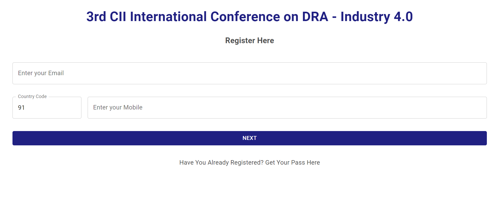
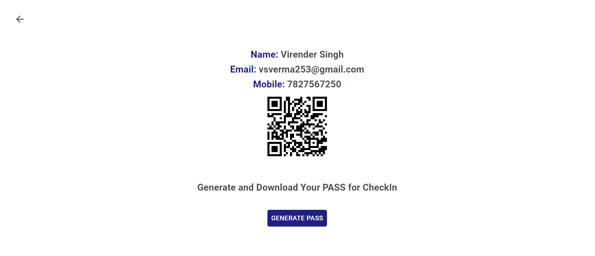

# Event Attendance Management with QR Technology

It seeks to modernize attendance tracking. By employing QR technology, it streamlines registration, ensuring real-time, accurate data for organizers and a seamless experience for attendees.

## Working

- Registration Website: Attendees register on a dedicated website, providing their details.

- QR Code Generation: Upon successful registration, a unique QR code (PASS) is generated for each attendee. This QR code contains encoded attendee information or serves as a reference to the data.

- QR Code Scanning: At the event location, organizers or staff use QR code scanners, typically mobile devices with cameras, to scan attendees' QR codes.

- Data Transfer to Google Sheets: The scanned data, including attendee details, is automatically transferred to a Google Sheets document using integration methods or APIs.

- Real-time Attendance Tracking: The system provides real-time attendance tracking, allowing organizers to monitor attendee presence as the QR codes are scanned.

- Data Security: Security measures are in place to protect attendee data, ensuring it is handled and stored securely.

By integrating QR technology with Next.js for the registration website and Google Sheets for data storage, this system streamlines the entire attendance management process, enhancing accuracy, efficiency, and accessibility of attendee data.

